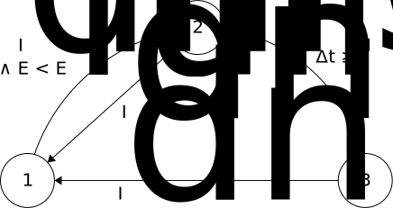
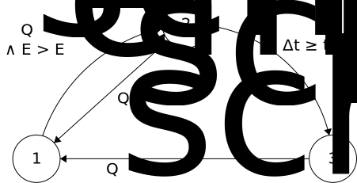

Tutorial
========

In this section we will step through the process of constructing two simple solar thermal power plant models.  These models are loosely based around a central tower receiver design with sodium heat-transfer fluid and storage.

The SimpleSystem model only considers energy transfers.  It has a very flat structure, only using a few components from libraries.  This makes it easy for the reader to understand exactly what is being modelled.  Discrete states are used for the control system.

The FluidSystem model is a bit more complicated as it models the heat-transfer fluid.  This model makes extensive use of models in the SolarTherm library.  It shows the object-orientated approach to modelling where different generic components can be customised and connected together.

SimpleSystem
------------

This model is provided as an example along with the source code: ``examples/SimpleSystem.mo``.  The different parts of this model will be described in this section.

The time-dependent variables are:

- :math:`I_{dni}`: DNI of sun (input)

- :math:`\dot{Q}_{sch}`: Scheduled discharge of tank (input)

- :math:`\dot{Q}_{rec}`: Heat flow into receiver from concentrator

- :math:`\dot{Q}_{chg}`: Heat flow charging tank

- :math:`\dot{Q}_{dis}`: Heat flow discharging tank

- :math:`P_{elec}`: Output electric power

- :math:`E`: Energy stored in tank

- :math:`S_{con} \in \{1,2,3\}`: Concentrator state (off, starting, on)

- :math:`S_{blk} \in \{1,2,3\}`: Power block state (off, starting, on)

The parameters are:

- :math:`A_{rec}`: Area of receiver aperture

- :math:`C`: Concentration ratio of concentrator/receiver combination

- :math:`\eta_{rec}`: Receiver efficiency

- :math:`\eta_{blk}`: Power block efficiency

- :math:`P_{rate}`: Power block electrical rating

- :math:`E_{max}`: Maximum amount of stored energy

The equations describing the system are:

.. math::
    
    \dot{Q}_{rec} &= \begin{cases}
        C A_{rec} I_{dni} & \text{if}~S_{con} = 3\\
        0 & \text{otherwise}
    \end{cases}\\
    \dot{Q}_{chg} &= \eta_{rec}\dot{Q}_{chg}\\
    \frac{dE}{dt} &= \dot{Q}_{chg} - \dot{Q}_{dis}\\
    \dot{Q}_{dis} &= \begin{cases}
        \dot{Q}_{sch} & \text{if}~S_{blk} \geq 2\\
        0 & \text{otherwise}
    \end{cases}\\
    P_{elec} &= \begin{cases}
        \eta_{blk}\dot{Q}_{dis} & \text{if}~S_{blk} = 3\\
        0 & \text{otherwise}
    \end{cases}

The state diagram for the concentrator is:

The state diagram for the power block is:

Model
"""""

We start off a new model with the name SimpleSystem:

.. code-block:: modelica

    model SimpleSystem
        // Imports

        // Parameters

        // Variables/Models

    initial equation

    algorithm

    equation

    end SimpleSystem;

We have given the model four sections: public, initial equation, algorithm and equation.  The public section is implicit, and we have further split it up into sections for imports, parameters and variables/models.

In the import section we import some packages which include standard types, constants and functions for doing conversions.

.. code-block:: modelica

    import SI = Modelica.SIunits;
    import CN = Modelica.Constants;
    import CV = Modelica.SIunits.Conversions;

Parameters
""""""""""

.. code-block:: modelica

FluidSystem
-----------

This model is provided as an example along with the source code: ``examples/FluidSystem.mo``.  The different parts of this model will be described in this section.

Simulating
----------

Copy the model to be simulated (here SimpleSystem) to a clean working directory.  Copy the resources folder ``examples/resources/`` to the same directory so that the simulation can find the weather data and market prices.

The command ``st_simulate SimpleSystem.mo`` will compile the model, compile the simulation and then run the simulation.  Let's do this step-by-step instead so that we can catch any errors along the way.  First compile the model to check for errors in our Modelica code (the ``--nosc`` flag turns off simulation compilation and ``--nosim`` turns off running the simulation)::

    st_simulate --nosc --nosim SimpleSystem.mo

Fix any errors that are produced by the OpenModelica compiler.  The next step is to compile the simulation using the compiled model (the ``--nomc`` flag turns off compiling the model, which we already just did)::

    st_simulate --nomc --nosim SimpleSystem.mo

Once this is done, we can run the simulation with its defaults (``--noc`` turns off all compilation)::

    st_simulate --noc SimpleSystem.mo

At the end of the simulation some performance metrics are produced for the system, for example, LCOE.

It is easy to produce a time-series plot of variables in the model, here DNI, output electricity, storage charging and stored energy::

    st_plotmat SimpleSystem_res.mat wea.wbus.dni:P_elec,Q_flow_chg E

The use of colons, commas and spaces in the above command highlights the simple notation used to indicate where to place each curve.  The names of the variables that may be plotted can be identified by either examining the original model, or alternatively listing them::

    st_plotmat -n SimpleSystem_res.mat

Results
-------

The following plot shows how the LCOE, spot market revenue and capacity factor vary with storage size for the SimpleSystem model.

.. plot:: plots/storage_simple.py
    :align: center

