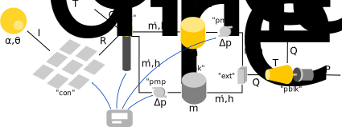
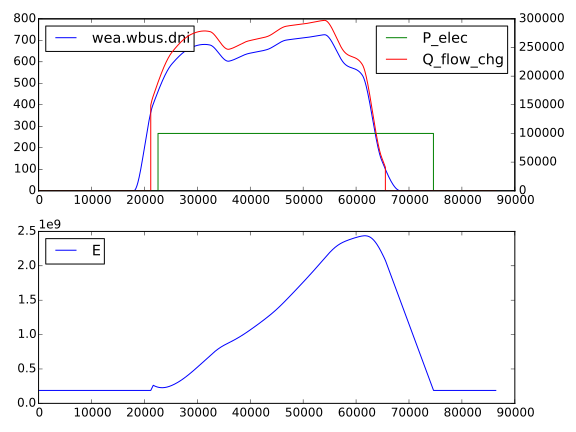
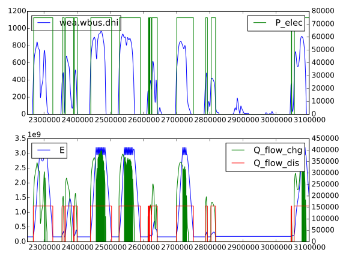
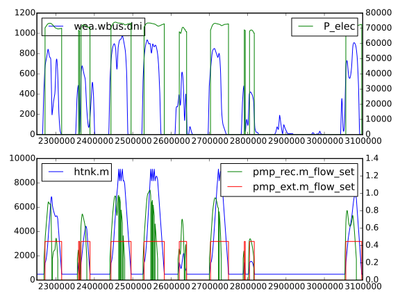
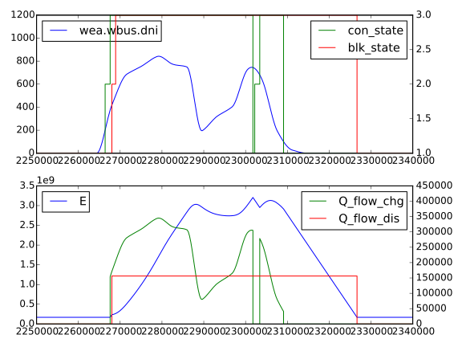

Tutorial
========

In this section we will step through the process of constructing two simple solar thermal power plant models.  These models are loosely based around a central tower receiver design with sodium heat-transfer fluid and storage.

The SimpleSystem model only considers energy transfers.  It has a very flat structure, only using a few components from libraries.  This makes it easy for the reader to understand exactly what is being modelled.  Discrete states are used for the control system.

The FluidSystem model is a bit more complicated as it models the heat-transfer fluid.  This model makes extensive use of models in the SolarTherm library.  It shows the object-orientated approach to modelling where different generic components can be customised and connected together.

SimpleSystem
------------

This model is provided as an example along with the source code: ``examples/SimpleSystem.mo``.  The different parts of this model will be described in this section.

The time-dependent variables are:

- :math:`I_{dni}`: DNI of sun (input)

- :math:`\dot{Q}_{sch}`: Scheduled discharge of tank (input)

- :math:`\dot{Q}_{rec}`: Heat flow into receiver from concentrator

- :math:`\dot{Q}_{chg}`: Heat flow charging tank

- :math:`\dot{Q}_{dis}`: Heat flow discharging tank

- :math:`P_{elec}`: Output electric power

- :math:`E`: Energy stored in tank

- :math:`S_{con} \in \{1,2,3\}`: Concentrator state (off, starting, on)

- :math:`S_{blk} \in \{1,2,3\}`: Power block state (off, starting, on)

The parameters are:

- :math:`A_{rec}`: Area of receiver aperture

- :math:`C`: Concentration ratio of concentrator/receiver combination

- :math:`\eta_{rec}`: Receiver efficiency

- :math:`\eta_{blk}`: Power block efficiency

- :math:`P_{rate}`: Power block electrical rating

- :math:`E_{max}`: Maximum amount of stored energy

The equations describing the system are:

.. math::
    
    \dot{Q}_{rec} &= \begin{cases}
        C A_{rec} I_{dni} & \text{if}~S_{con} = 3\\
        0 & \text{otherwise}
    \end{cases}\\
    \dot{Q}_{chg} &= \eta_{rec}\dot{Q}_{chg}\\
    \frac{dE}{dt} &= \dot{Q}_{chg} - \dot{Q}_{dis}\\
    \dot{Q}_{dis} &= \begin{cases}
        \dot{Q}_{sch} & \text{if}~S_{blk} \geq 2\\
        0 & \text{otherwise}
    \end{cases}\\
    P_{elec} &= \begin{cases}
        \eta_{blk}\dot{Q}_{dis} & \text{if}~S_{blk} = 3\\
        0 & \text{otherwise}
    \end{cases}

The state diagram for the concentrator is:

.. image:: images/state_con.svg
    :align: center
    :height: 180px

The state diagram for the power block is:

.. image:: images/state_blk.svg
    :align: center
    :height: 180px

Model
"""""

We start off a new model with the name SimpleSystem:

.. code-block:: modelica

    model SimpleSystem
        // Imports

        // Parameters

        // Variables/Models

    initial equation

    algorithm

    equation

    end SimpleSystem;

We have given the model four sections: public, initial equation, algorithm and equation.  The public section is implicit, and we have further split it up into sections for imports, parameters and variables/models.

In the import section we import some packages which include standard types, constants and functions for doing conversions.

.. .. literalinclude:: ../../examples/SimpleSystem.mo
..    :language: modelica
..    :tab-width: 4
..    :lines: 3-5

.. code-block:: modelica

	import SI = Modelica.SIunits;
	import CN = Modelica.Constants;
	import CV = Modelica.SIunits.Conversions;

Parameters
""""""""""

The first two parameters provide the file names for tabulated weather data and spot market prices. We place these in a subfolder ``resources`` relative to where the simulation is run.  These files have a format that can be read by table models from the Modelica standard library.  The weather file can also be a standard TMY3 file, which will automatically get converted to a suitable format with the ``st_py_wea_to_mo`` script.  The ``st_get_aemo_prices`` script can be used manually to download and convert prices from AEMO.

.. code-block:: modelica

	parameter String weaFile = "resources/Mildura_Real2010_Created20130430.motab";
	parameter String priFile = "resources/aemo_vic_2014.motab";

The next group of parameters describe physical values of the system.  Of particular interest are ``t_storage`` and ``P_rate`` which we will modify for different experiments.

.. code-block:: modelica

	parameter SI.Area A_con = 700 "Area of concentrator";
	parameter SI.Area A_rec = 1 "Area of receiver aperture";
	parameter Real C = 0.65*A_con/A_rec "Concentration ratio";
	parameter SI.Efficiency eff_rec = 0.9 "Receiver efficiency";
	parameter SI.Efficiency eff_blk = 0.48 "Power block efficiency";
	parameter SI.Power P_rate = 100000 "Power block nominal power";
	parameter Real t_storage(unit="hour") = 5 "Hours of storage";
	parameter SI.Energy E_max = P_rate*t_storage*3600/eff_blk "Max stored energy";

This group of parameters define some trips for the control.

.. code-block:: modelica

	parameter SI.Energy E_up_u = 0.95*E_max "Upper energy limit";
	parameter SI.Energy E_up_l = 0.93*E_max "Upper energy limit";
	parameter SI.Energy E_low_u = 0.07*E_max "Lower energy limit";
	parameter SI.Energy E_low_l = 0.05*E_max "Lower energy limit";
	parameter SI.Irradiance dni_stop = 100 "DNI at which concentrator stops";
	parameter SI.Irradiance dni_start = 200 "DNI at which concentrator starts";

	parameter SI.Time t_con_on_delay = 20*60 "Delay until concentrator starts";
	parameter SI.Time t_blk_on_delay = 15*60 "Delay until power block starts";

These parameters provide a way for defining a schedule for operating the power block.  The current values are equivalent to always running the power block at full power (subject to there being enough stored energy).

.. code-block:: modelica

	parameter Integer n_sched_states = 1 "Number of schedule states";
	parameter Integer sch_state_start(min=1, max=n_sched_states) = 1 "Starting schedule state";
	parameter SI.Time t_sch_next_start = 0 "Time to next schedule change";
	parameter SI.HeatFlowRate Q_flow_sched_val[n_sched_states] = {
			P_rate/eff_blk
			} "Heat flow at schedule states";
	parameter SI.Time t_delta[n_sched_states] = {
			24*3600
			} "Time differences between schedule states";

The last group of parameters calculate the capital and maintenance costs of the system, which are required to calculate the LCOE for the plant.

.. code-block:: modelica

	parameter SolarTherm.Utilities.Finances.Money C_cap =
			120*A_con // field cost
			+ 135*C*A_rec // receiver cost
			+ (30/(1e3*3600))*E_max // storage cost
			+ (1440/1e3)*P_rate // power block cost
			"Capital costs";
	parameter SolarTherm.Utilities.Finances.MoneyPerYear C_main =
			10*A_con // field cleaning/maintenance
			"Maintenance costs for each year";
	parameter Real r_disc = 0.05 "Discount rate";
	parameter Integer t_life(unit="year") = 20 "Lifetime of plant";

Variables/Models
""""""""""""""""

First we define the models that load in the weather and price data, and provide
access to them through variables.

.. code-block:: modelica

	SolarTherm.Utilities.Weather.WeatherSource wea(weaFile=weaFile);
	SolarTherm.Utilities.Finances.SpotPriceTable pri(fileName=priFile);

The physical variables for the plant are defined.

.. code-block:: modelica

	SI.HeatFlowRate Q_flow_rec "Heat flow into receiver";
	SI.HeatFlowRate Q_flow_chg "Heat flow into tank";
	SI.HeatFlowRate Q_flow_dis "Heat flow out of tank";
	SI.Power P_elec "Output power of power block";

	SI.Energy E(min=0, max=E_max) "Stored energy";

	SI.HeatFlowRate Q_flow_sched "Discharge schedule";

The control states and discrete variables for triggering time events are defined.

.. code-block:: modelica

	Integer con_state(min=1, max=3) "Concentrator state";
	Integer blk_state(min=1, max=3) "Power block state";
	Integer sch_state(min=1, max=n_sched_states) "Schedule state";

	Real t_con_next "Time of next concentrator event";
	Real t_blk_next "Time of next power block event";
	Real t_sch_next "Time of next schedule change";

Last of all we define variables to integrate up the amount of revenue from the spot market and the total amount of electricity generated.  We also fix their starting value to 0, which could alternatively be done in the initial equation section instead.

.. code-block:: modelica

	SolarTherm.Utilities.Finances.Money R_spot(start=0, fixed=true)
		"Spot market revenue";
	SI.Energy E_elec(start=0, fixed=true) "Generate electricity";

Initial Equation
""""""""""""""""

The initial equation section allows us to specify starting values (or equations) for variables.  We only do it for the state variables, as the initial values for the rest of the variables can be calculated from these.

.. code-block:: modelica

    E = E_low_l;
    Q_flow_sched = Q_flow_sched_val[sch_state_start];
    con_state = 1;
    blk_state = 1;
    sch_state = sch_state_start;
    t_con_next = 0;
    t_blk_next = 0;
    t_sch_next = t_sch_next_start;

Algorithm
"""""""""

Then algorithm section is used to directly set the value of a variable on the left hand of the ``:=`` symbol.  In an algorithm section a variable can be set more than once this way.  This is different from an equation section where the number of equations must remain the same for all possible active branches.

According to the Modelica language spec, most (if not all) the relations in this section could actually go in the equation section.  However, the OpenModelica specification hasn't fully implemented the spec with regards to systems of equations with discrete variables.  So we instead have to put them in the algorithm section.  It is not clear exactly what does and doesn't work, so in practice some trial and error and reading of compilation errors may be needed.

The first part of the algorithms section defines all the state transitions.

.. code-block:: modelica

	when con_state >= 2 and (wea.wbus.dni <= dni_stop or E >= E_up_u) then
		con_state := 1; // off sun
	elsewhen con_state == 1 and wea.wbus.dni >= dni_start and E <= E_up_l then
		con_state := 2; // start onsteering
	elsewhen con_state == 2 and time >= t_con_next then
		con_state := 3; // on sun
	end when;

	when blk_state >= 2 and (Q_flow_sched <= 0 or E <= E_low_l) then
		blk_state := 1; // off
	elsewhen blk_state == 1 and Q_flow_sched > 0 and E >= E_low_u  then
		blk_state := 2; // starting
	elsewhen blk_state == 2 and time >= t_blk_next then
		blk_state := 3; // on
	end when;

	when time >= t_sch_next then
		sch_state := mod(pre(sch_state), n_sched_states) + 1;
	end when;

The second part deals with setting the counters when a state changes and setting the flow schedule.

.. code-block:: modelica

	when con_state == 2 then
		t_con_next := time + t_con_on_delay;
	end when;

	when blk_state == 2 then
		t_blk_next := time + t_blk_on_delay;
	end when;

	for i in 1:n_sched_states loop
		when sch_state == i then
			Q_flow_sched := Q_flow_sched_val[i];
			t_sch_next := time + t_delta[i];
		end when;
	end for;

Equation
""""""""

The equation section includes the differential and algebraic equations.  These equations change as the states change, but the total number of equations always remains the same.

.. code-block:: modelica

	Q_flow_chg = eff_rec*Q_flow_rec;

	der(E) = Q_flow_chg - Q_flow_dis;

	Q_flow_rec = if con_state <= 2 then 0 else C*wea.wbus.dni*A_rec;

	Q_flow_dis = if blk_state <= 1 then 0 else Q_flow_sched;

	P_elec = if blk_state <= 2 then 0 else eff_blk*Q_flow_dis;

	der(E_elec) = P_elec;
	der(R_spot) = P_elec*pri.price;

FluidSystem
-----------

This model is provided as an example along with the source code: ``examples/FluidSystem.mo``.  The different parts of this model will be described in this section.

By pushing components of the plant into their own models, for example, receiver variables and equations into a receiver model, we can reuse them in different plants and greatly simplify the system model.  The top level system model then just needs to set the parameters and connect together components.

The FluidSystem model is considerably more complicated than the SimpleSystem model, but most of the extra complexity is hidden in the component models.  Some modelling of the control is still done at the system level, but this could also be put into a model of its own.

The diagram below gives a rough outline of the different components in the model and how they connect together.

We focus on sections of interest in FluidSystem instead of walking through the whole model.

The Modelica standard library makes it easy to define different fluids and use them interchangeably in models.  A fluid is defined in a Media package, which gets passed on to all models that used the fluid.  Here we load in the Sodium fluid package and define some common system parameters which will be used by all models contained with the system model.

.. code-block:: modelica

	replaceable package MedRec = SolarTherm.Media.Sodium;

	inner Modelica.Fluid.System system(
		energyDynamics=Modelica.Fluid.Types.Dynamics.FixedInitial,
		allowFlowReversal=false);

After defining all plant parameters, the component models are created (some of the constructor arguments have been omitted for brevity) and some control variables.

.. code-block:: modelica

	SolarTherm.Utilities.Weather.WeatherSource wea(weaFile=weaFile);
	SolarTherm.Utilities.Finances.SpotPriceTable pri(fileName=priFile);

	SolarTherm.Optics.IdealInc con(A_con=A_con, A_foc=A_rec);

	SolarTherm.Receivers.Plate rec(...);

	SolarTherm.Pumps.IdealPump pmp_rec(...);
	SolarTherm.Pumps.IdealPump pmp_ext(...);

	SolarTherm.Storage.FluidTank ctnk(...);
	SolarTherm.Storage.FluidTank htnk(...);

	SolarTherm.HeatExchangers.Extractor ext(...);

	SolarTherm.PowerBlocks.HeatGen pblk(...);

	SolarTherm.Control.Trigger hf_trig(...);
	SolarTherm.Control.Trigger cf_trig(...);

	Boolean radiance_good "Adequate radiant power on receiver";
	Boolean fill_htnk "Hot tank can be filled";
	Boolean fill_ctnk "Cold tank can be filled";

The connectors of these components are then connected together in the equation section.

.. code-block:: modelica

	connect(wea.wbus, con.wbus);
	connect(wea.wbus, rec.wbus);
	connect(wea.wbus, pblk.wbus);
	connect(con.R_foc, rec.R);
	connect(ctnk.port_b, pmp_rec.port_a);
	connect(pmp_rec.port_b, rec.port_a);
	connect(rec.port_b, htnk.port_a);

	connect(htnk.port_b, pmp_exc.port_a);
	connect(pmp_exc.port_b, ext.port_a);
	connect(ext.port_b, ctnk.port_a);

	connect(ext.Q_flow, pblk.Q_flow);
	connect(ext.T, pblk.T);

	connect(hf_trig.x, htnk.m);
	connect(cf_trig.x, ctnk.m);

Finally the equations for controlling the whole system are included.

.. code-block:: modelica

	radiance_good = rec.R >= R_go;

	fill_htnk = not hf_trig.y;
	fill_ctnk = not cf_trig.y;

	rec.door_open = radiance_good and fill_htnk;
	pmp_rec.m_flow_set = if radiance_good and fill_htnk then m_flow_fac*rec.R/(A_con*1000) else 0;
	pmp_exc.m_flow_set = if fill_ctnk then m_flow_pblk else 0;

	con.track = true;

Simulating
----------

Copy the model to be simulated (here SimpleSystem) to a clean working directory.  Copy the resources folder ``examples/resources/`` to the same directory so that the simulation can find the weather data and market prices.

The command ``st_simulate SimpleSystem.mo`` will compile the model, compile the simulation and then run the simulation in one go.  Let's do this step-by-step instead so that we can catch any errors along the way.  First compile the model to check for errors in our Modelica code (the ``--nosc`` flag turns off simulation compilation and ``--nosim`` turns off running the simulation)::

    st_simulate --nosc --nosim SimpleSystem.mo

Fix any errors that are produced by the OpenModelica compiler.  The next step is to compile the simulation using the compiled model (the ``--nomc`` flag turns off compiling the model, which we already just did)::

    st_simulate --nomc --nosim SimpleSystem.mo

Once this is done, we can run the simulation with its defaults (``--noc`` turns off all compilation)::

    st_simulate --noc SimpleSystem.mo

At the end of the simulation some performance metrics are produced for the system, including the LCOE.

It is easy to produce a time-series plot of variables in the model, here DNI, output electricity, storage charging and stored energy::

    st_plotmat SimpleSystem_res.mat wea.wbus.dni:P_elec,Q_flow_chg E

One day of operation in this time series is shown below.

The use of colons, commas and spaces in the above command highlights the simple notation used to indicate where to place each curve.  The names of the variables that may be plotted can be identified by either examining the original model, or alternatively listing them::

    st_plotmat -n SimpleSystem_res.mat

Results
-------

Control Switching
"""""""""""""""""

The plots below show the operation of the plants for 10 consecutive days out of the year.  The top two plots are for SimpleSystem and the bottom two for FluidSystem.  SimpleSystem is displayed in terms of stored energy and power charging and discharging the storage tank.  FluidSystem represents these as the hot tank mass and mass flows instead.  The charging and discharging powers and mass flows are directly controlled in response to the fluid levels in the tanks and the current solar DNI.

Both models have approximately equivalent values for storage hours and power block ratings.  The collector, receiver and heat transfer components of SimpleSystem are more efficient than for FluidSystem.  This results in more energy being captured and the tank filling up faster.  It also results in more switching events to prevent the tank from overflowing.  The power blocks in both models run at full power when there is available energy in the tank.  This will prevent as much energy being spilt as possible, however a more financially rewarding control strategy would also take into consideration prices on the spot market.

The next plot focuses in on the control state of SimpleSystem for a single day.  It shows transitions between the different control states and how it relates to the transfers of energy.  The concentrator switches from the off state (``con_state = 1``) to the start tracking state (``con_state = 2``) in the morning once the solar DNI gets strong enough.  It takes some time for the concentrator to fully focus and for the receiver to heat up, which is approximated by a delay before power actually starts to come out of the receiver (``con_state = 3``).  At one point in the day the tank reaches near its upper limit, and the concentrator momentarily switches off to avoid overflowing the tank.  The power block state follows a similar behaviour, but switches on and off in response to the tank energy being above/below a certain threshold.

The commands to produce and plot the above results are::

    st_simulate --stop 31536000 --step 300 SimpleSystem.mo t_storage=6 P_rate=75000
    st_plotmat --xlim 2.25e6 3.1e6 SimpleSystem_res.mat wea.wbus.dni:P_elec E:Q_flow_chg,Q_flow_dis
    st_simulate --stop 31536000 --step 300 FluidSystem.mo t_storage=6 P_rate=75000
    st_plotmat --xlim 2.25e6 3.1e6 FluidSystem_res.mat wea.wbus.dni:P_elec htnk.m:pmp_rec.m_flow_set,pmp_ext.m_flow_set
    st_plotmat --xlim 2.25e6 2.34e6 SimpleSystem_res.mat wea.wbus.dni:con_state,blk_state E:Q_flow_chg,Q_flow_dis

Parameter Sweeps
""""""""""""""""

The following plot shows how the LCOE, spot market revenue and capacity factor vary with storage size for the SimpleSystem model.

.. plot:: plots/storage_simple.py
    :align: center
    :height: 400px

The next plot shows the same thing but for the FluidSystem model.

.. plot:: plots/storage_fluid.py
    :align: center
    :height: 400px

This plot shows how the LCOE changes for different power block ratings and storage hours for the SimpleSystem.

.. plot:: plots/pow_simple.py
    :align: center
    :height: 400px

The same thing for the FluidSystem.

.. plot:: plots/pow_fluid.py
    :align: center
    :height: 400px

The commands to produce the results for the above plots are respectively::
    
    st_simulate --stop 31536000 --step 300 SimpleSystem.mo t_storage=3,4,6,7,8,9,10,11,12,13,14,15 
    st_simulate --stop 31536000 --step 300 FluidSystem.mo t_storage=2,2.5,3,3.5,4,4.5,5,5.5,6,6.5,7,7.5,8
    st_simulate --stop 31536000 --step 300 SimpleSystem.mo P_rate=50000,75000,100000,125000 t_storage=2,3,4,5,6,7,8,9,10,11,12 
    st_simulate --stop 31536000 --step 300 FluidSystem.mo P_rate=50000,75000,100000,125000 t_storage=2,3,4,5,6,7,8,9,10,11,12 

Optimisation
""""""""""""

We can apply simple search techniques to optimise model parameters.  For example, the following call will search (using the default method) for a value that minimises the LCOE for SimpleSystem over the power block rate and storage parameters::

    st_optimise --maxiter 20 --stop 31536000 --step 300 -v SimpleSystem.mo P_rate=50000,150000,100000 t_storage=3,15,5

After 20 iterations the best solution it has found is for a power block rate of 69kW and storage time of 14hrs.  The same approach for the FluidSystem produces a solution of 68kW and 8hrs.  Note that both system models don't have any thermal losses from the storage vessels, and the power block costs are much higher than the storage costs, this tends to favour a very large storage system so that the power block size can be reduced.
